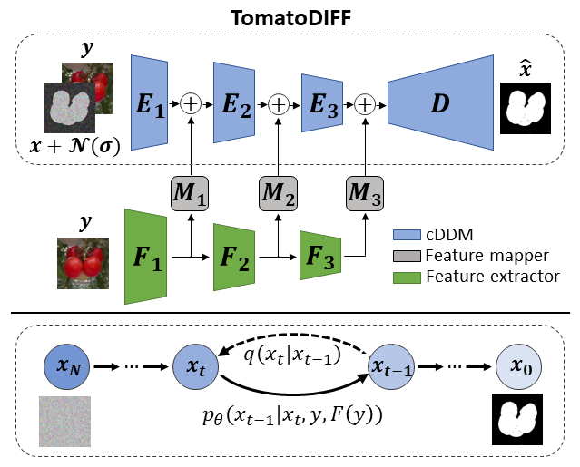

# TomatoDIFF
Official implementation of the paper "TomatoDIFF: On–plant Tomato Segmentation with Denoising Diffusion Models" [^1].
TomatoDIFF is a diffusion-based model developed for semantic segmentation of on-plant tomatoes. 



For more information please refer to the paper available [here](https://unilj-my.sharepoint.com/:u:/g/personal/mivanovska_fe1_uni-lj_si/Efx0vR20H0NHmJqZfPOIb1ABEKULOeKKuFL68DwLPh4QeQ?e=nOLwEP).

## 1. Install the dependencies
The model is implemented using PyTorch. The full list of used libraries can be found in requirements.txt.
```
pip install -r requirements.txt
```
## 2. Prepare you data
Our dataset **Tomatopia** is available for download [here](https://unilj-my.sharepoint.com/:u:/g/personal/mivanovska_fe1_uni-lj_si/Efx0vR20H0NHmJqZfPOIb1ABEKULOeKKuFL68DwLPh4QeQ?e=nOLwEP).

The datasets you are using for training or testing TomatoDIFF should be placed in the directory called data. Datasets should have the following directory structure:
```
Dataset_name
├── train
│   ├── images
│   │   └── train_img_1.png
│   │   └── train_img_2.png
│   │   └── ...
│   ├── masks
│   ├── features_1
│   ├── features_2
│   ├── features_3
├── test
│   ├── images
│   │   └── test_img_1.png
│   │   └── test_img_2.png
│   │   └── ...
│   ├── masks
│   │   └── ...
│   ├── features_1
│   │   └── ...
│   ├── features_2
│   │   └── ...
│   ├── features_3
│   │   └── ...
```
## 3. Training
## 4. Testing
## 5. Citing TomatoDIFF
If you find this code useful, use our dataset Tomatopia or you want to refer to the paper, please cite using the following BibTeX:
```
@INPROCEEDINGS{ivanovska2023TomatoDIFF,
  author={Ivanovska, Marija and Perš, Janez and Štruc, Vitomir},
  booktitle={2023 18th International Conference on Machine Vision and Applications (MVA)}, 
  title={TomatoDIFF: On–plant Tomato Segmentation with Denoising Diffusion Models}, 
  year={2023}}
```

## Acknowledgements
This code is based on [k-diffusion](https://github.com/crowsonkb/k-diffusion).

## References
[^1]: M. Ivanovska, J. Perš, V. Štruc, TomatoDIFF: On–plant Tomato Segmentation with Denoising Diffusion Models, International Conference on Machine Vision Applications (MVA), 2023
